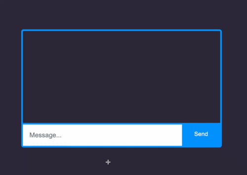

# Socket Chat App

#### An example for a Chat App which created with ReactJs, Scoket.IO and NodeJS.

#### By Egemen Kar

## Preview

* User 1 login into room 123

* User 2 login into room 123

* Chat example

## Technologies Used

Front-End (Client)

* React
* Socket.IO Client

Back-End (Server)

* Node JS
* Express
* Socket.IO
* Cors

## Description

I just created a chat app with socket.io. This app includes different rooms and username. You can chat in realtime.

## Setup/Installation Requirements

* Clone this repository to your desktop.
* You need to have NodeJs on your computer.
* Npm install dependencies for client and server.
* "Node index.js" to start the server and "npm start" to start the client side React app.

## License

Licensed under the [MIT License](LICENSE)

Copyright (c) 2021 Egemen Kar